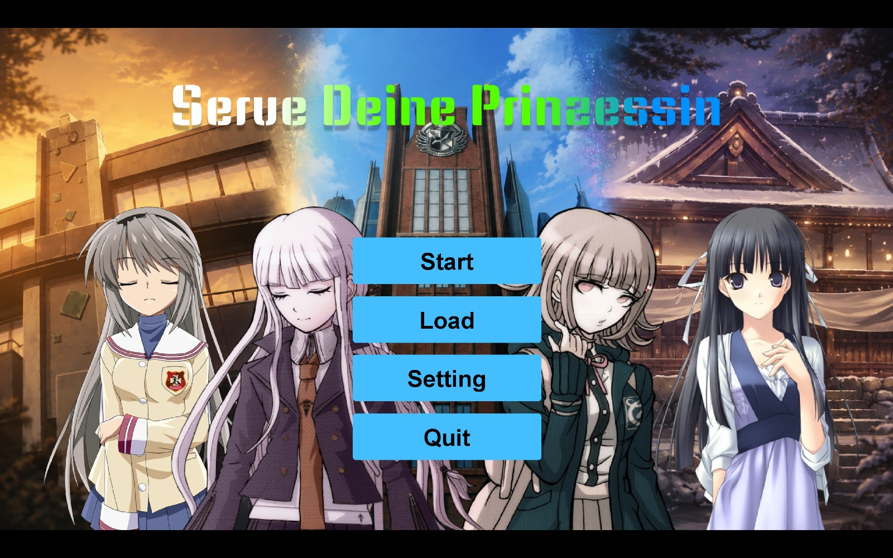
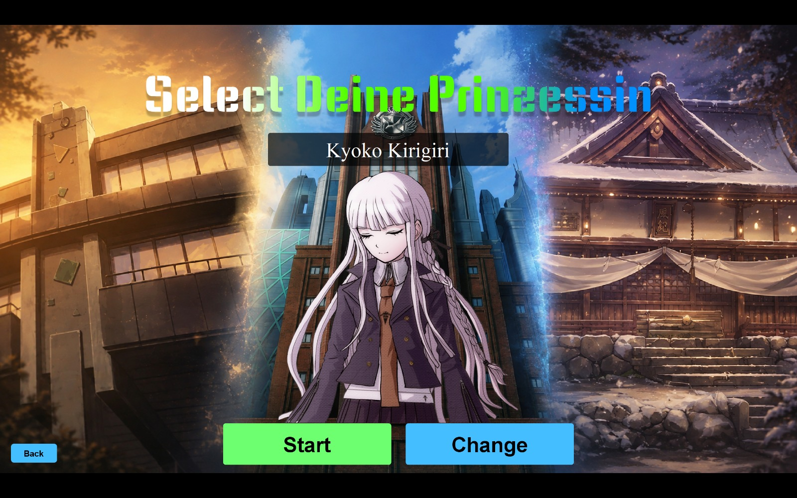
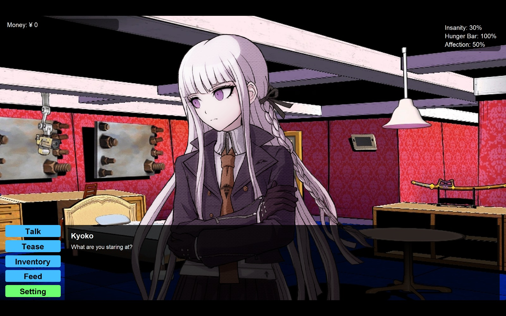
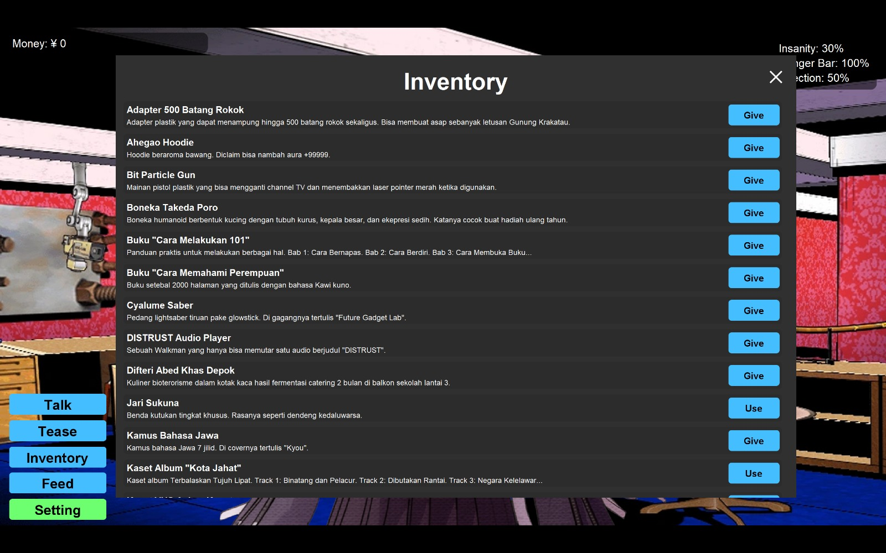
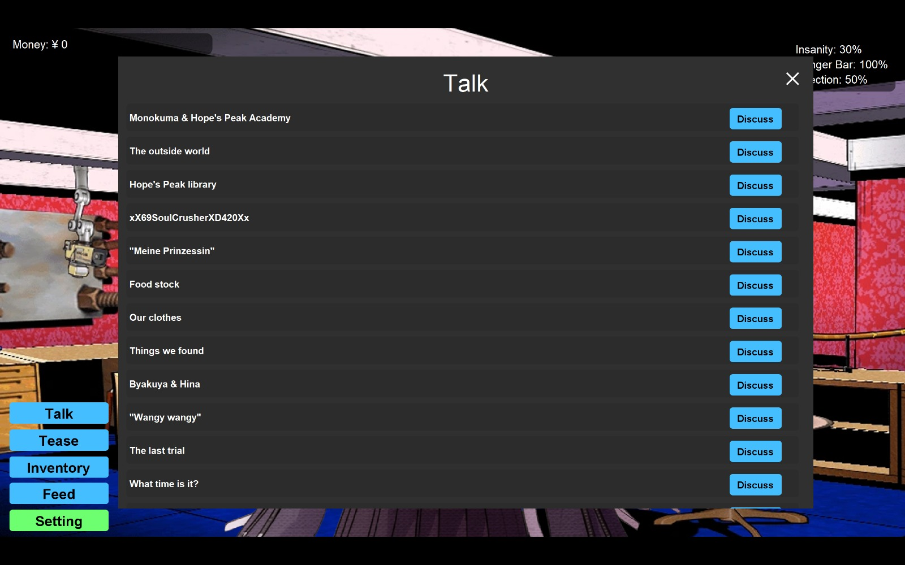

# Serve Deine Prinzessin

> **A small Java interactive narrative / dating game with dialogue, gifts, questionable life decisions, and four Prinzessins. 😂**


**Serve Deine Prinzessin** is a small, single-player interactive narrative game built with pure Java Swing.

Choose a Prinzessin, interact with her through dialogue and various actions, manage your **Hunger**, **Insanity**, and **Affection**, and try not to accidentally push one of them into an extreme state.

There are **5 possible endings for each Prinzessin**, with the outcome determined by how you manage those three stats.

> **This repository contains the production version of the game.**

---

## Screenshots

### Home Screen



### Prinzessin Select Screen



### Dialogue



### Inventory



### Talk Options



---

## About the Game

The game is built around a simple idea:

**Pick a Prinzessin and spend time with her without completely screwing up her state.**

Each Prinzessin follows the same general gameplay structure, while her individual content is primarily expressed through dialogue, preferences, reactions, items, and interactions.

The game currently features four selectable Prinzessins:

| Prinzessin          | Origin                             |
| ------------------- | ---------------------------------- |
| **Kyoko Kirigiri**  | *Danganronpa: Trigger Happy Havoc* |
| **Chiaki Nanami**   | *Danganronpa 2: Goodbye Despair*   |
| **Sakagami Tomoyo** | *CLANNAD*                          |
| **Migiwa Kazuha**   | *Yosuga no Sora*                   |

The project is a crossover fan game built around a fictionalized "what if" scenario where the protagonist is essentially a version of the player.

The current version focuses its completed content on **Kyoko Kirigiri**, while the remaining Prinzessins are represented in the selection system and are planned for future content.

---

## Gameplay

The core gameplay revolves around three stats:

* **Hunger**
* **Insanity**
* **Affection**

Each stat is displayed numerically in the upper-right corner of the game screen.

Stats are modified through player interactions. Depending on the interaction, changes can occur during dialogue or immediately after the interaction has completed.

### Endings

Each Prinzessin has **5 different endings**.

Endings are triggered when a relevant stat reaches an extreme point:

* **0% Hunger** → an ending
* **0% Affection** → an ending
* **100% Affection** → an ending
* **0% Insanity** → an ending
* **100% Insanity** → an ending

Hunger reaching **100% is logically impossible** under normal gameplay and therefore does not have an associated ending.

If a stat happens to overshoot its normal range, the extreme condition still applies. For example, a value of `101%` still counts as reaching `100%`, while `-1%` still counts as reaching `0%`.

The ending is triggered immediately once the relevant condition is reached.

The endings are intentionally ambiguous rather than being explicitly categorized as "good" or "bad". The **0% Hunger ending** is the closest thing to an unambiguously bad outcome.

### Staying in the Game

If you want to keep playing and explore more content instead of immediately reaching an ending, keep the three stats away from their extreme points.

> **Balance your stats if you want the game to last longer.**

---

## Game Flow

A new game follows this flow:

```text
Home Screen
     │
     ▼
Prinzessin Selection
     │
     ▼
Enter Player Name
     │
     ▼
Game
```

The player first chooses which Prinzessin to serve and then provides their player name before entering the main game.

---

## Interactions

The player has several ways to interact with the selected Prinzessin.

### `[Talk]`

Choose from available discussion topics.

Topics can have requirements and may become available depending on the current state or progression.

Dialogue is one of the primary sources of character-specific content.

### `[Tease]`

Teasing can be performed repeatedly.

Its effects depend on the current **Affection** and **Hunger** states, meaning that repeatedly teasing without considering your current stats can produce unexpected results.

### `[Give]`

Give an item from the inventory to the current Prinzessin.

Gifts:

* Can only be given once.
* Are removed from the inventory after being given.
* Have effects based on the Prinzessin's preferences.

The same gift may therefore produce different results depending on who receives it.

### `[Use]`

Use a consumable item from the inventory.

Consumables are deliberately one of the game's more chaotic systems.

Their effects are **not explicitly explained** by their descriptions. Depending on the current state of the game, a consumable can potentially save you from a bad situation—or make it considerably worse.

Part of the intended experience is figuring out what they actually do.

### `[Feed]`

Feed the current Prinzessin.

Feeding can be performed repeatedly and does not consume a separate resource.

Its effects depend on the current **Affection** and **Hunger** values, so the same action can produce different results depending on the current state.

---

## Inventory

The game provides **30 physical inventory slots**.

Items are broadly divided into two categories:

* **Gifts** — used through `[Give]`
* **Consumables** — used through `[Use]`

Items can have unique behaviors and may interact with the current game state in ways that are not immediately obvious.

Future content can introduce additional items and acquisition methods through interactions such as `[Talk]`, `[Tease]`, or `[Feed]`.

> **Tip:** An item's description may not tell you the whole story.

---

## Controls

The game is primarily mouse-driven.

| Input                 | Action                              |
| --------------------- | ----------------------------------- |
| **Left Mouse Button** | Navigate menus and interact with UI |
| **Enter**             | Advance dialogue                    |
| **Hold Enter**        | Fast-forward dialogue               |

The main interaction buttons available during gameplay are:

* `[Talk]`
* `[Tease]`
* `[Inventory]`
* `[Feed]`

There is no traditional pause button. Leaving the game idle is effectively safe: **stats do not change while no interaction is taking place.**

---

## Settings

This version supports the following display modes:

* `2560 × 1440`
* `1920 × 1080`
* `1280 × 720`
* Fullscreen

---

## Save & Load

This version includes a functional **Save/Load system**.

Persistent data is separated from runtime state and handled through the game's persistence layer.

The persistence system stores the data necessary to restore a game session, including relevant session, presentation, inventory, stat, and topic information.

---

## Running the Game

### Requirements

* **JDK 26 or newer**
* Windows or Linux
* A Java environment capable of running Java Swing applications

There is no specific minimum OS version. If your system can run the required JDK version, the game should be able to run.

### Running from Source

The project does not use Maven or Gradle. External dependencies are included directly in the repository:

```text
lib/
├── jackson-annotations-2.22.jar
├── jackson-core-2.22.2.jar
├── jackson-databind-2.22.2.jar
└── java-vorbis-support-1.2.1.jar
```

The dependencies are already part of the project, so cloning the repository provides the required libraries.

The project entry point is:

```text
src/Main.java
```

---

## Technical Stack

### Language

**Java 26**

### GUI

**Java Swing**

The application is built directly on Java's standard GUI toolkit without a dedicated game engine or external UI framework.

### Audio

**OGG/Vorbis**

The project uses OGG audio resources for music and other audio content.

`java-vorbis-support-1.2.1.jar` is used to provide Vorbis playback support.

### Data Serialization

This version uses the Jackson libraries for structured data handling:

* `jackson-annotations`
* `jackson-core`
* `jackson-databind`

These are primarily used by the persistence/data layer.

---

## Architecture

<!-- Architecture documentation will be added here. -->

---

## Project Structure

This version is organized into several domain-oriented areas.

```text
.
├── lib/
│   ├── jackson-annotations-2.22.jar
│   ├── jackson-core-2.22.2.jar
│   ├── jackson-databind-2.22.2.jar
│   └── java-vorbis-support-1.2.1.jar
│
├── src/
│   ├── assets/
│   ├── META-INF/
│   ├── sdp/
│   │   ├── content/
│   │   ├── modules/
│   │   ├── persistence/
│   │   ├── shared/
│   │   └── ui/
│   │
│   └── Main.java
│
└── Serve Deine Prinzessin Remastered.iml
```

### `content/`

Contains the game's domain content and gameplay logic.

```text
content/
├── gameplay/
├── prinzessins/
└── stats/
```

The gameplay area contains the interaction systems for:

* Feeding
* Inventory
* Story progression
* Talking
* Teasing

Prinzessin-specific content is separated into its own domain areas, allowing individual characters to have their own dialogue, topics, items, assets, and behaviors.

The `stats` package handles the game's Hunger, Affection, and Insanity systems.

### `modules/`

Contains reusable application/game modules such as:

* Asset management
* Audio
* Generic behavior abstractions
* Dialogue execution
* Requirement handling

These modules provide reusable infrastructure for the domain content without directly representing a specific Prinzessin.

### `persistence/`

Contains the Save/Load and data management systems.

The persistence layer separates:

* Persistent data
* Runtime data
* Data transfer objects
* Data access APIs

This allows game state to be represented independently from the UI and gameplay controllers.

### `shared/`

Contains data transfer objects, shared exceptions, and general-purpose utilities used across different parts of the application.

### `ui/`

Contains the Java Swing presentation layer.

It includes:

* Screens
* Dialogs
* UI components
* Game canvas
* Resolution handling
* Viewport/scaling logic

The UI is responsible for presenting game state and receiving player input rather than owning the core gameplay rules.

---

## Prinzessin Content

The content system is designed to keep generic gameplay logic separate from individual Prinzessin implementations.

Each Prinzessin can have their own:

* Assets
* Dialogue
* Items
* Topics
* Behaviors
* Requirements
* Preferences

The current repository contains dedicated content structures for:

* **Kyoko Kirigiri**
* **Chiaki Nanami**
* **Sakagami Tomoyo**
* **Migiwa Kazuha**

At the current stage, **Kyoko** is the primary fully hydrated Prinzessin.

The architecture allows additional Prinzessin content to be introduced without fundamentally changing the generic interaction systems.

---

## Content Discovery

Not everything in the game is meant to be explicitly explained.

There are various easter eggs, unusual dialogue, special item behaviors, and hidden interactions throughout the game.

Pay attention to:

* Dialogue
* Item descriptions
* Character reactions
* Consumable effects
* Repeated interactions
* Changes in the current game state

There is no free-roaming exploration system. Discovery happens primarily through the interaction, dialogue, item, and state systems.

---

## Performance

This version is approximately **5.833% heavier** than the beta version in performance/resource terms.

The increase is considered acceptable relative to the added functionality, particularly the persistence system and expanded domain/content structure.

---

## Development

**Serve Deine Prinzessin** is a solo project.

Built primarily as:

* a game made for fun;
* a Java programming project;
* a Java Swing project;
* and a personal portfolio project.

The game deliberately does not rely on a commercial game engine.

The entire application layer, gameplay systems, UI, dialogue framework, persistence system, audio handling, and content architecture were implemented directly in Java.

### Team

```text
Me, Myself, and I.
```

---

## Release vs. Beta

This version is not simply a content update of the original beta.

The underlying architecture was substantially reorganized to provide a cleaner separation between domain content, reusable modules, persistence, shared structures, and presentation.

The core gameplay concept remains largely unchanged.

### Major changes

| Feature                       | Beta                            | Final                                |
| ----------------------------- | ------------------------------- | ------------------------------------ |
| Prinzessin selection          | Yes                             | Yes                                  |
| Player name                   | Before selection                | After selection                      |
| Hunger / Affection / Insanity | Yes                             | Yes                                  |
| 5 endings per Prinzessin      | Yes                             | Yes                                  |
| Talk                          | Yes                             | Yes                                  |
| Tease                         | Yes                             | Yes                                  |
| Feed                          | Yes                             | Yes                                  |
| Inventory                     | Yes                             | Yes                                  |
| Save/Load                     | Not functional                  | **Functional**                       |
| Resolution                    | 1920×1080 / 1600×900 / 1280×720 | **2560×1440 / 1920×1080 / 1280×720** |
| Kyoko content                 | Partial                         | **Primary hydrated content**         |
| Architecture                  | Development beta structure      | **RDMGA**                            |

---

## Roadmap

The long-term goal is primarily **content expansion** rather than changing the fundamental gameplay loop.

Planned work includes:

* Additional Kyoko content
* Full content for Chiaki Nanami
* Full content for Sakagami Tomoyo
* Full content for Migiwa Kazuha
* Additional dialogue
* Additional items
* Additional interaction behaviors
* More secrets and easter eggs
* General balancing and polish

The underlying interaction architecture is designed to make adding future Prinzessin-specific content easier without having to rewrite the generic gameplay systems.

---

## Credits & Copyright

This project is a private fan-made game and is **not affiliated with, endorsed by, or officially associated with** the original franchises or their respective copyright holders.

The game references characters and settings originating from:

* *Danganronpa: Trigger Happy Havoc*
* *Danganronpa 2: Goodbye Despair*
* *CLANNAD*
* *Yosuga no Sora*

Character names, original characters, music, sprites, backgrounds, sound effects, voice assets, and other third-party materials remain the property of their respective copyright holders.

**All third-party game assets are copyrighted and are not licensed for redistribution.**

This repository is intended for private development and portfolio/demo purposes.

---

## License

No open-source license is provided.

The original source code and project materials are **not licensed for redistribution**.

Third-party characters, assets, music, audio, and other copyrighted materials remain subject to their respective copyright holders.

Please do not redistribute the repository, game assets, or packaged game content as your own work.

---

## Disclaimer

**Serve Deine Prinzessin** is a non-commercial fan-made project created for experimentation, entertainment, and personal portfolio purposes.

The project is not an official entry into any of the referenced franchises.

The protagonist is intentionally presented as a fictionalized version of the player in a crossover "what if" scenario.

---

## Final Note

This project started as a small experiment in Java Swing and gradually became a considerably more structured game system.

It may contain questionable decisions.

Some of them are made by the player.

Some of them are made by the Prinzessin.

And some of them are probably made by the developer.

> **Serve your Prinzessin. Manage your stats. Make questionable life decisions.**