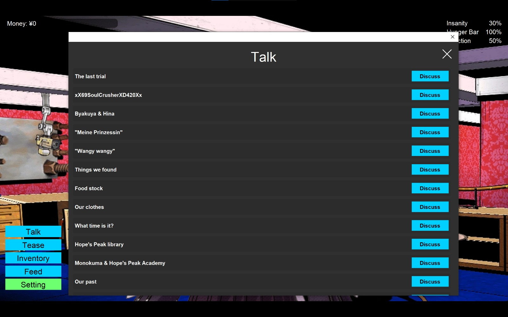

# Serve Deine Prinzessin

> **A small Java interactive narrative / dating game with dialogue, gifts, questionable life decisions, and four Prinzessins. 😂**


**Serve Deine Prinzessin** is a small, single-player interactive narrative game built with pure Java Swing.

Choose a Prinzessin, interact with her through dialogue and various actions, manage your **Hunger**, **Insanity**, and **Affection**, and try not to accidentally push one of them into an extreme state.

There are **5 possible endings for each Prinzessin**, with the outcome determined by how you manage those three stats.

> **This repository contains the development beta.**
> It is an unfinished and intentionally unstable version of the game. Some systems are placeholders, some content is incomplete, and certain features visible in the UI are not functional yet.

---

## Screenshots

### Home Screen


### Prinzessin Select Screen


### Dialogue


### Inventory


### Talk Options



---

## About the Game

The game is structured around a simple idea:

**Pick a Prinzessin and spend time with her without completely screwing up her state.**

Each Prinzessin follows the same general gameplay structure, but the actual content comes from her dialogue, preferences, reactions, and available items.

The current beta contains four selectable Prinzessinnen:

| Prinzessin          | Origin                             |
| ------------------- | ---------------------------------- |
| **Kyoko Kirigiri**  | *Danganronpa: Trigger Happy Havoc* |
| **Chiaki Nanami**   | *Danganronpa 2: Goodbye Despair*   |
| **Sakagami Tomoyo** | *CLANNAD*                          |
| **Migiwa Kazuha**   | *Yosuga no Sora*                   |

The project is essentially a crossover **what-if/fan game** where the protagonist is a fictionalized version of the player.

The final version is expected to be content-hydrated primarily around **Kyoko Kirigiri**, with the other Prinzessinnen planned for future content.

---

## Gameplay

The core gameplay revolves around three stats:

* **Hunger**
* **Insanity**
* **Affection**

Each stat is displayed numerically on the game screen.

Interactions can modify these values immediately, including during dialogue or after an interaction has finished.

### Endings

Each Prinzessin has **5 different endings**.

Endings are triggered when a relevant stat reaches an extreme point:

* **0% Hunger** → an ending
* **0% Affection** → an ending
* **100% Affection** → an ending
* **0% Insanity** → an ending
* **100% Insanity** → an ending

Hunger reaching **100% is logically impossible** under normal gameplay and therefore does not have an associated ending.

The game does not explicitly classify its endings as "good" or "bad". Most endings are intentionally ambiguous, although the **0% Hunger ending** is the closest thing to an unambiguously bad outcome.

A stat can technically overshoot its normal range due to gameplay behavior, potentially reaching values such as `-1%` or `101%`. This still counts as reaching the corresponding extreme and will trigger the ending immediately.

### Want to Keep Playing?

You don't necessarily want to hit an ending immediately.

If you want to explore more dialogue, items, reactions, and interactions, the general idea is to keep all three stats away from their extreme points.

In other words:

> **Balance your stats if you want the game to last longer.**

---

## Interactions

The player has several ways to interact with the selected Prinzessin.

### `[Talk]`

Choose from available discussion topics.

Some topics may only become available after certain conditions are met, so not every topic is necessarily visible from the beginning.

The dialogue system is one of the main sources of character-specific content in the game.

### `[Tease]`

Teasing can be performed repeatedly.

Its effects are not completely predictable because the resulting stat changes depend on the current **Affection** and **Hunger** states.

Repeatedly pressing the button without considering your current stats may therefore have consequences.

### `[Give]`

Give an item from your inventory to the current Prinzessin.

Gifts:

* Can only be given once per item.
* Are removed from the inventory after being given.
* Have effects based on the Prinzessin's preferences.

Choosing the right gift can therefore matter.

### `[Use]`

Use a consumable item from the inventory.

Consumables are deliberately one of the game's more chaotic systems.

Their effects are **not explicitly explained** by their descriptions. Depending on the current state of the game, a consumable can potentially save you from a bad situation—or make it considerably worse.

Part of the intended experience is figuring out what things actually do.

### `[Feed]`

Feed the current Prinzessin.

Feeding can be performed repeatedly and does not consume a separate resource.

Its effects depend on the current **Affection** and **Hunger** values, meaning that the same action can produce different results depending on the current state.

---

## Inventory

The beta provides **30 physical inventory slots**.

Currently, the beta contains 30 item types, so the number of available item types happens to match the inventory capacity. This is not necessarily a permanent limitation on the number of item types.

Items are divided into two broad categories:

* **Gifts** — used through `[Give]`
* **Consumables** — used through `[Use]`

Items currently available in the beta are obtained as part of the starting inventory. Future content may introduce items that need to be acquired through interactions such as `[Talk]`, `[Tease]`, or `[Feed]`.

There are also several item-related secrets and unusual effects to discover.

> **Tip:** Don't assume an item's description tells you everything about it.

---

## Controls

The game is primarily mouse-driven.

| Input                 | Action                              |
| --------------------- | ----------------------------------- |
| **Left Mouse Button** | Navigate menus and interact with UI |
| **Enter**             | Advance dialogue                    |
| **Hold Enter**        | Fast-forward dialogue               |

The interaction buttons available during gameplay include:

* `[Talk]`
* `[Tease]`
* `[Inventory]`
* `[Feed]`
* `[Setting]`

There is no traditional pause button. Simply leaving the game idle is effectively safe: **stats do not change while no interaction is taking place.**

---

## Settings

The beta currently supports the following display resolutions:

* `1920 × 1080`
* `1600 × 900`
* `1280 × 720`
* Fullscreen

Additional settings may appear in the interface as development continues.

---

## Running the Beta

### Requirements

* **JDK 21 or newer**
* Windows or Linux
* A Java environment capable of running Java Swing applications

There is no specific minimum OS version. If your system can run the required JDK version, the game should be able to run.

### Option 1 — Run the JAR

Download or obtain:

```text
Serve Deine Prinzessin GUI.jar
```

Then run:

```bash
java -jar "Serve Deine Prinzessin GUI.jar"
```

The required Vorbis audio dependency is bundled with the project/JAR setup, so it should not need to be downloaded separately.

### Option 2 — Run from Source

Clone the repository and open the project in IntelliJ IDEA.

The external dependency is included in:

```text
lib/
└── java-vorbis-support-1.2.1.jar
```

The project was developed using IntelliJ IDEA and does not use Maven or Gradle.

The current beta is intended primarily as a development build, so running the provided JAR is the easiest way to try it.

---

## Technical Details

The beta is intentionally built without a game engine or external UI framework.

### Stack

* **Java 21**
* **Java Swing**
* **Java2D**
* **OGG/Vorbis audio support**

The GUI, gameplay systems, dialogue handling, inventory, character state, audio handling, persistence layer, and interaction logic are implemented directly in Java.

The project is organized roughly around several responsibilities:

```text
src/sdp/
├── audio/          Audio playback and channel management
├── characters/     Character definitions and state
├── dialogues/      Dialogue data and dialogue controllers
├── gameplay/       Game state and interaction logic
├── items/          Inventory items and item behaviors
├── persistence/    Runtime and persistent data handling
└── ui/             Swing UI, screens, dialogs, and components
```

The beta's architecture is not intended to be representative of the final game's architecture. The production version is planned to receive a backend interaction-logic overhaul while keeping the core gameplay concept largely intact.

---

## Project Structure

A simplified view of the beta source tree:

```text
.
├── lib/
│   └── java-vorbis-support-1.2.1.jar
│
├── src/
│   └── sdp/
│       ├── audio/
│       ├── characters/
│       ├── dialogues/
│       ├── gameplay/
│       ├── items/
│       ├── persistence/
│       └── ui/
│
├── Serve Deine Prinzessin GUI.jar
└── Serve Deine Prinzessin GUI.iml
```

The `ui` package contains the Swing-based application interface, including the home screen, Prinzessin selection screen, game screen, dialogue boxes, inventory dialogs, interaction buttons, and settings.

The `gameplay`, `characters`, `dialogues`, and `items` packages contain the actual game logic and content systems, while `audio` handles music, sound effects, voice channels, and OGG/Vorbis playback.

---

## Audio

The beta uses **OGG/Vorbis** for music and other audio resources.

A small external library is used for Vorbis playback:

```text
java-vorbis-support-1.2.1.jar
```

The dependency is included in the repository's `lib/` directory and bundled with the playable JAR.

OGG was chosen primarily to avoid the unnecessarily large file sizes that would result from using uncompressed WAV assets.

---

## Current Beta Status

This is a **beta/development build**, not the final release.

### Implemented

* [x] Prinzessin selection
* [x] Interactive dialogue
* [x] Hunger system
* [x] Insanity system
* [x] Affection system
* [x] Stat-based endings
* [x] Talk interactions
* [x] Tease interactions
* [x] Feed interactions
* [x] Inventory system
* [x] Gift items
* [x] Consumable items
* [x] Character preferences
* [x] Music/audio playback
* [x] Multiple display resolutions
* [x] Fullscreen mode
* [x] Dialogue fast-forward
* [x] Four Prinzessinnen in the selection screen

### Not Yet Complete

* [ ] Save/Load functionality
* [ ] Complete content hydration
* [ ] Final interaction backend
* [ ] Full production content
* [ ] Additional Prinzessin content

The **Save** and **Load** buttons are already present in the beta UI, but they are not functional yet.

The final version is expected to use substantially different backend interaction logic. The overall gameplay loop, however, is expected to remain broadly the same.

---

## Secrets & Discovery

Not everything is meant to be explained.

There are various easter eggs, unusual dialogue, special item behaviors, and hidden interactions throughout the game.

Some of them can be found by paying attention to:

* Dialogue
* Item descriptions
* Character reactions
* Unusual consumable effects
* Repeated interactions
* Changes in the current game state

There is no dedicated exploration system or free-roaming map. Discovery primarily happens through the interaction systems themselves.

---

## Development

**Serve Deine Prinzessin** is a solo project.

Built primarily as:

* a small game made for fun;
* a Java/Swing programming project;
* and a personal portfolio project.

The project does not use a commercial game engine. The GUI and underlying game systems were implemented directly using Java and Swing.

Development time is intentionally not tracked consistently because the project has been worked on sporadically.

---

## Roadmap

The production version is primarily focused on **content hydration and backend refinement**, rather than changing the fundamental gameplay loop.

Planned work includes:

* Complete Kyoko content
* Additional Prinzessin content
* Functional Save/Load
* Expanded item acquisition
* More dialogue and interactions
* Finalized interaction logic
* General stabilization and cleanup

The other three Prinzessinnen are currently considered **coming soon**.

Or perhaps not.

---

## Credits & Copyright

This project is a private fan-made game and is **not an official product** of any of the franchises or characters referenced in it.

Character names, original characters, music, sprites, backgrounds, sound effects, and other referenced assets may belong to their respective copyright holders.

The assets included in this private repository are used for personal development and portfolio/demo purposes.

**All game assets are copyrighted and are not licensed for redistribution.**

This repository itself is **not released under an open-source license**.

Please do not redistribute the game's assets or package the project as your own work.

---

## Disclaimer

This is a fan-made, non-commercial project created for experimentation, entertainment, and personal portfolio purposes.

Any resemblance to the original works is intentional.

The protagonist is essentially a fictionalized "what if" version of the player rather than an attempt to recreate or replace the protagonists of the original visual novels.

---

## Beta Warning

> **The beta is an unstable shell.**

Expect unfinished content, questionable balancing, incomplete systems, weird edge cases, and things that probably should not happen.

If something breaks, congratulations: you found beta content.

---

## License

No open-source license is currently provided.

All rights reserved to their respective copyright holders for third-party characters and assets.

The original source code and original project material are not licensed for redistribution.
