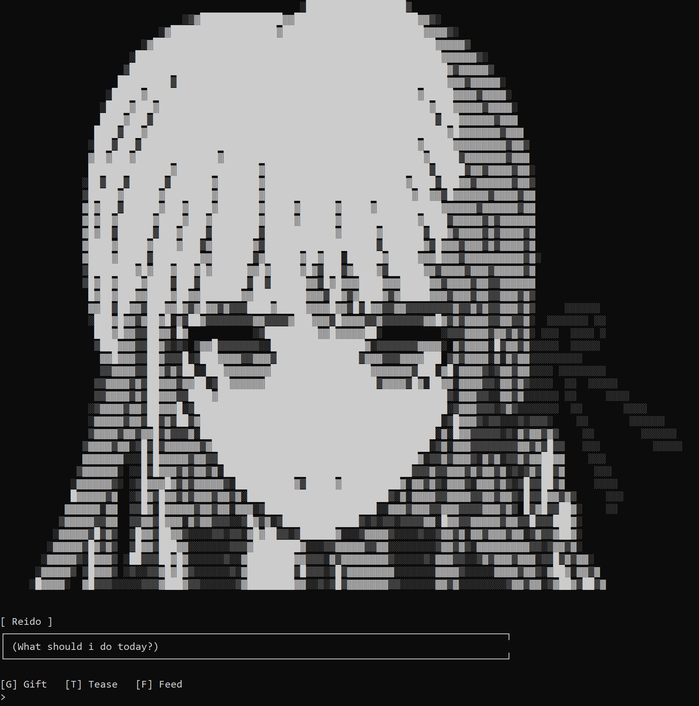
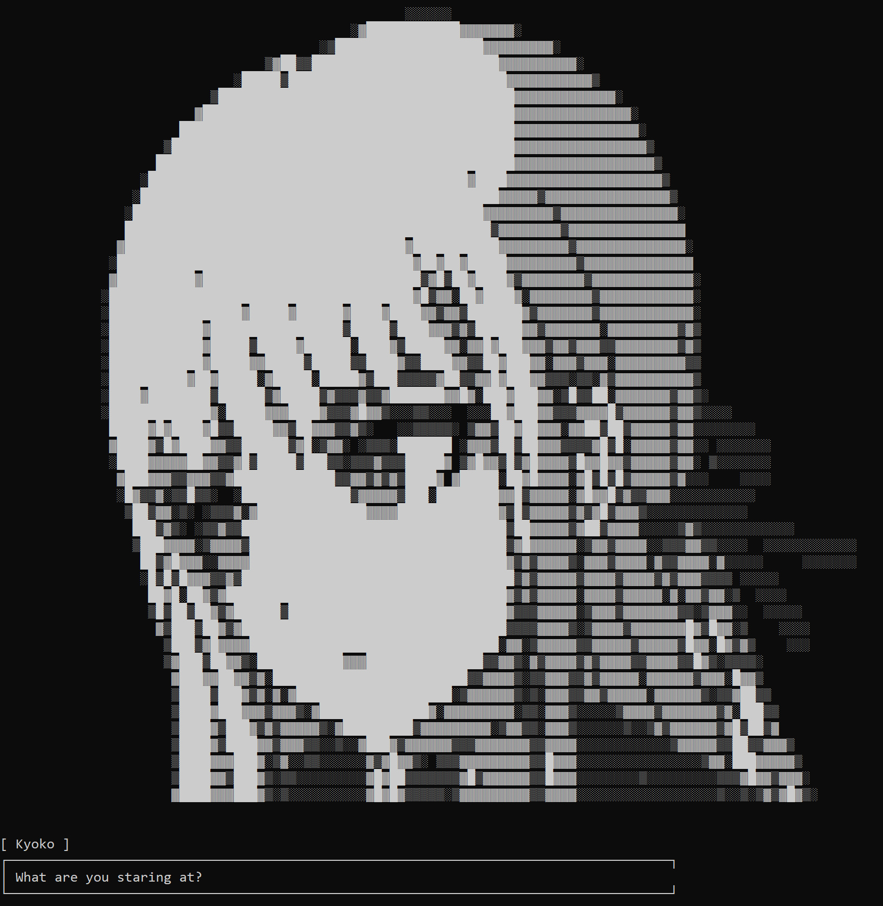
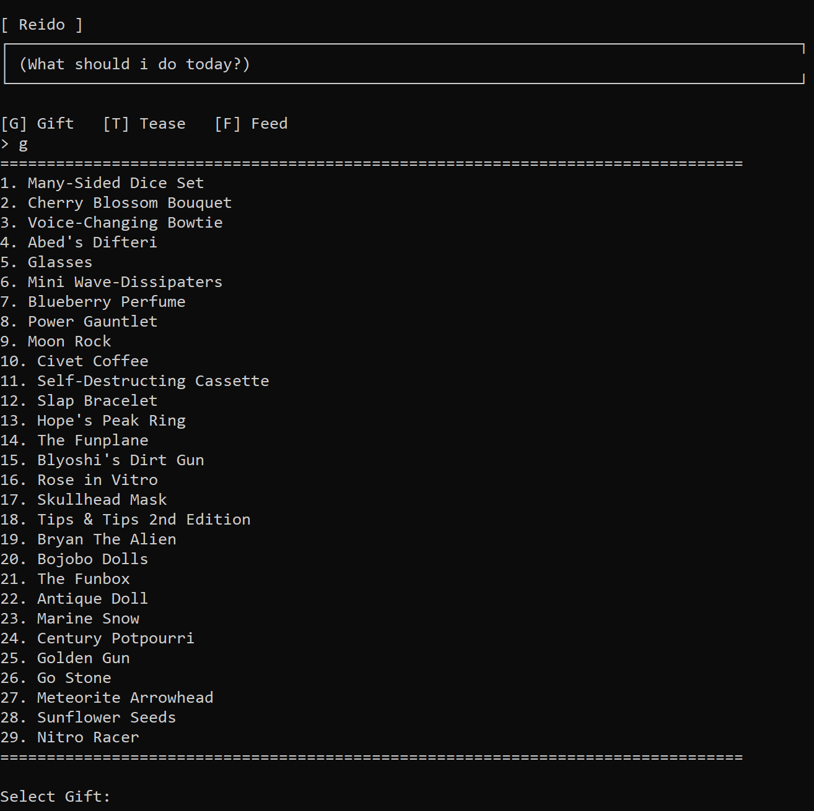

# Serve Deine Prinzessin

> **A small Java CLI dating / interaction game with ASCII art, dialogue, gifts, and questionable life decisions. 😂**



**Serve Deine Prinzessin** is a simple command-line game where you interact with a character through dialogue and several activities.

---

## 🎮 Gameplay

You start by entering your player name and choosing a character to interact with.

Currently, the only available character is:

* **Kyoko**

Once the interaction begins, you can:

| Action   | Key | Description                                        | Status                |
| -------- | --: | -------------------------------------------------- | --------------------- |
| 🎁 Gift  | `G` | Open the inventory and give Kyoko an item          | ✅ Functional          |
| 😏 Tease | `T` | Tease Kyoko and trigger a random dialogue sequence | ✅ Functional          |
| 🍴 Feed  | `F` | Feed the current character                         | 🚧 Not functional yet |

---

## 🖥️ CLI Version

This version runs entirely inside the terminal.

Character sprites are rendered using **ASCII art**, while dialogue is displayed with a typewriter-style effect.

### Screenshots

#### Dialogue



#### Gift Selection (Inventory)



---

## ✨ Features

* 🧑 Custom player name
* 👸 Character selection
* 💬 Dialogue system
* 🎲 Randomized dialogue responses
* 🎁 Gift system with different reactions
* 😏 Teasing interaction
* 🎭 Character states with different ASCII sprites
* ⌨️ Fully keyboard-driven CLI gameplay
* ☕ Written in Java

---

## 🕹️ Controls

After entering the game, the main interaction menu is:

```text
[G] Gift   [T] Tease   [F] Feed
>
```

### Gift

Press `G` to open the gift selection.

Example:

```text
================================================================================
1. Some Gift
2. Another Gift
3. Something Else
================================================================================

Select Gift:
```

The character's response depends on the selected item's effect.

Possible reactions include:

* **Satisfied**
* **Likes**
* **Neutral**
* **Disappointed**

Some responses are randomized, so giving the same type of gift does not necessarily produce exactly the same dialogue every time.

### Tease

Press `T` to tease the current character.

The game randomly selects:

1. A player teasing line
2. A character response

Both are then displayed as a dialogue sequence.

### Feed

Press `F` to select the feeding interaction.

This feature is currently displayed in the menu but is **not functional yet**.

---

## 🚀 Running the Game

### Option 1 — Run the JAR

A compiled JAR is included in the repository:

```text
Serve Deine Prinzessin.jar
```

Run it with:

```bash
java -jar "Serve Deine Prinzessin.jar"
```

Make sure Java is installed and available through your system's `PATH`.

### Option 2 — Run from Source

Clone the repository:

```bash
git clone <repository-url>
cd <repository-directory>
```

Then open the project using an IDE such as IntelliJ IDEA and run the main application.

---

## ☕ Requirements

* Java **17+**
* A terminal capable of displaying standard Unicode characters

Java 17 is recommended because the project uses modern Java syntax such as text blocks and switch expressions.

---

## 📦 Dependencies

None.

The CLI version is built entirely using the Java standard library.

---

## 🔮 Future Versions

*Serve Deine Prinzessin* is planned as a multi-version project.

The **CLI version** is the simplest implementation and serves as the foundation for future versions with more advanced interfaces and gameplay.

Possible future improvements include:

* More characters
* More character states and expressions
* More gifts
* Expanded dialogue
* Functional feeding interaction
* More interaction types
* Save / load system
* Graphical interface
* Additional game content

---

## 📜 License

This project is currently for personal / experimental use.

No license has been specified yet.
